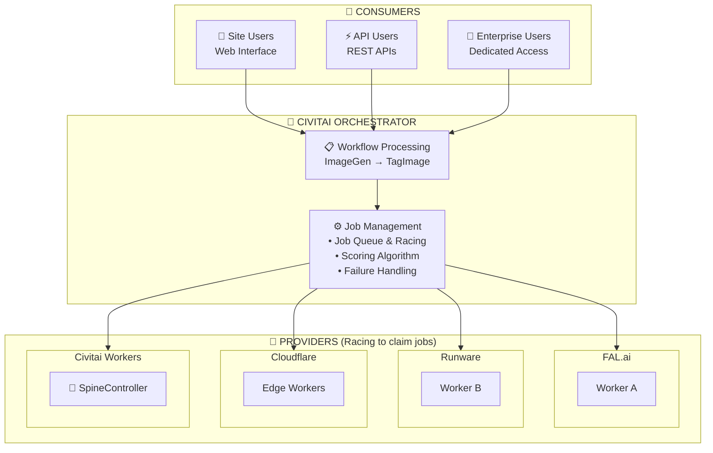
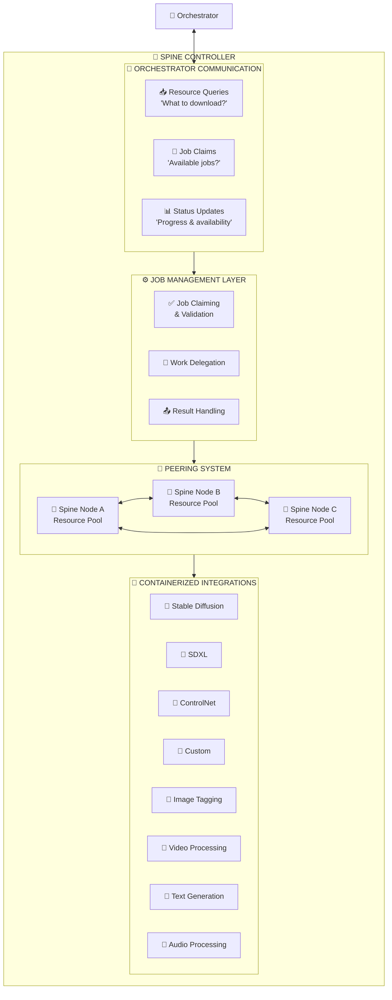
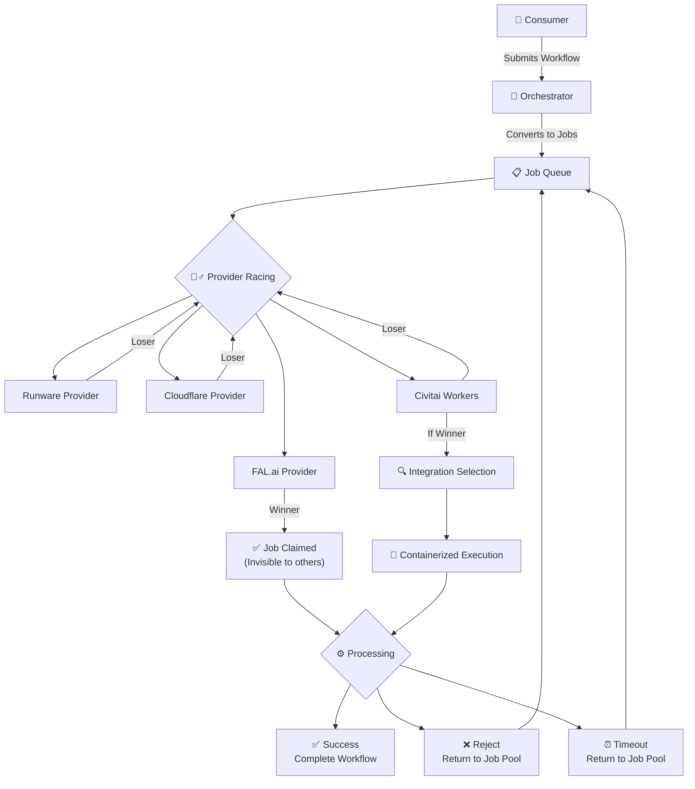
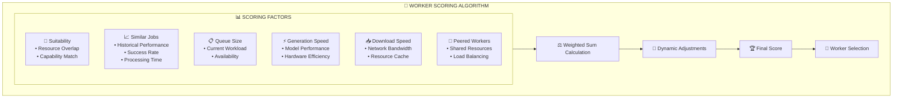
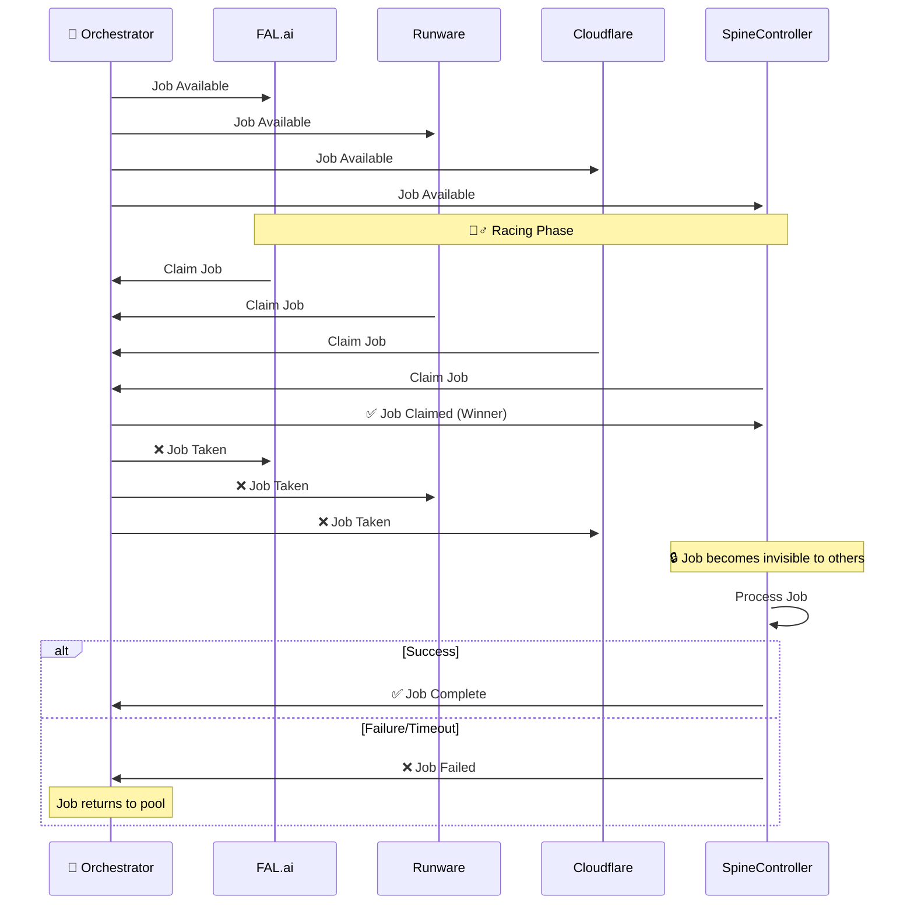

# Civitai Orchestrator Architecture Diagrams

## System Overview

```mermaid
graph TB
    %% Consumers
    subgraph Consumers["🏢 CONSUMERS"]
        SiteUsers["👤 Site Users<br/>Web Interface"]
        APIUsers["⚡ API Users<br/>REST APIs"]
        EnterpriseUsers["🏢 Enterprise Users<br/>Dedicated Access"]
    end

    %% Orchestrator
    subgraph Orchestrator["🎯 CIVITAI ORCHESTRATOR"]
        WorkflowProcessor["📋 Workflow Processing<br/>ImageGen → TagImage"]
        JobManager["⚙️ Job Management<br/>• Job Queue & Racing<br/>• Scoring Algorithm<br/>• Failure Handling"]
    end

    %% Providers
    subgraph Providers["🔧 PROVIDERS (Racing to claim jobs)"]
        subgraph FAL["FAL.ai"]
            FALWorkerA["Worker A"]
        end
        
        subgraph Runware["Runware"]
            RunwareWorkerB["Worker B"]
        end
        
        subgraph Cloudflare["Cloudflare"]
            CFWorkers["Edge Workers"]
        end
        
        subgraph CivitaiWorkers["Civitai Workers"]
            SpineController["🦴 SpineController"]
        end
    end

    %% Flow
    SiteUsers --> WorkflowProcessor
    APIUsers --> WorkflowProcessor  
    EnterpriseUsers --> WorkflowProcessor
    WorkflowProcessor --> JobManager
    JobManager --> FAL
    JobManager --> Runware
    JobManager --> Cloudflare
    JobManager --> CivitaiWorkers
```

## SpineController Detailed Architecture

```mermaid
graph TB
    subgraph SpineController["🦴 SPINE CONTROLLER"]
        %% Communication Layer
        subgraph CommLayer["📡 ORCHESTRATOR COMMUNICATION"]
            ResourceQueries["📥 Resource Queries<br/>'What to download?'"]
            JobClaims["🎯 Job Claims<br/>'Available jobs?'"]
            StatusUpdates["📊 Status Updates<br/>'Progress & availability'"]
        end
        
        %% Job Management
        subgraph JobMgmt["⚙️ JOB MANAGEMENT LAYER"]
            JobClaiming["✅ Job Claiming<br/>& Validation"]
            WorkDelegation["🔄 Work Delegation"]
            ResultHandling["📤 Result Handling"]
        end
        
        %% Peering System
        subgraph PeeringSystem["🤝 PEERING SYSTEM"]
            SpineA["🦴 Spine Node A<br/>Resource Pool"]
            SpineB["🦴 Spine Node B<br/>Resource Pool"] 
            SpineC["🦴 Spine Node C<br/>Resource Pool"]
            SpineA <--> SpineB
            SpineB <--> SpineC
            SpineA <--> SpineC
        end
        
        %% Integrations
        subgraph Integrations["🐳 CONTAINERIZED INTEGRATIONS"]
            SD["🐳 Stable Diffusion"]
            SDXL["🐳 SDXL"]
            ControlNet["🐳 ControlNet"]
            Custom["🐳 Custom"]
            
            ImageTag["🐳 Image Tagging"]
            VideoProc["🐳 Video Processing"]
            TextGen["🐳 Text Generation"]
            AudioProc["🐳 Audio Processing"]
        end
    end
    
    %% External connections
    Orchestrator["🎯 Orchestrator"] <--> CommLayer
    CommLayer --> JobMgmt
    JobMgmt --> PeeringSystem
    PeeringSystem --> Integrations
```

## Job Lifecycle Flow

```mermaid
flowchart TD
    Consumer["👤 Consumer"] --> |Submits Workflow| Orchestrator["🎯 Orchestrator"]
    Orchestrator --> |Converts to Jobs| JobQueue["📋 Job Queue"]
    
    JobQueue --> Racing{"🏃‍♂️ Provider Racing"}
    
    %% Providers competing
    Racing --> FAL["FAL.ai Provider"]
    Racing --> Runware["Runware Provider"] 
    Racing --> Cloudflare["Cloudflare Provider"]
    Racing --> CivitaiWorkers["Civitai Workers"]
    
    FAL --> |Winner| JobClaimed["✅ Job Claimed<br/>(Invisible to others)"]
    Runware --> |Loser| Racing
    Cloudflare --> |Loser| Racing  
    CivitaiWorkers --> |Loser| Racing
    
    JobClaimed --> Processing{"⚙️ Processing"}
    
    %% For Civitai Workers (SpineController)
    CivitaiWorkers --> |If Winner| IntegrationSelection["🔍 Integration Selection"]
    IntegrationSelection --> ContainerExecution["🐳 Containerized Execution"]
    ContainerExecution --> Processing
    
    Processing --> Success["✅ Success<br/>Complete Workflow"]
    Processing --> Reject["❌ Reject<br/>Return to Job Pool"]
    Processing --> Timeout["⏰ Timeout<br/>Return to Job Pool"]
    
    Reject --> JobQueue
    Timeout --> JobQueue
```

## Worker Scoring Algorithm

```mermaid
graph TB
    subgraph ScoringAlgorithm["🎯 WORKER SCORING ALGORITHM"]
        %% Input factors
        subgraph Factors["📊 SCORING FACTORS"]
            Suitability["🎯 Suitability<br/>• Resource Overlap<br/>• Capability Match"]
            SimilarJobs["📈 Similar Jobs<br/>• Historical Performance<br/>• Success Rate<br/>• Processing Time"]
            QueueSize["📋 Queue Size<br/>• Current Workload<br/>• Availability"]
            
            GenSpeed["⚡ Generation Speed<br/>• Model Performance<br/>• Hardware Efficiency"]
            DownloadSpeed["📥 Download Speed<br/>• Network Bandwidth<br/>• Resource Cache"]
            PeeredWorkers["🤝 Peered Workers<br/>• Shared Resources<br/>• Load Balancing"]
        end
        
        %% Scoring process
        Factors --> WeightedSum["⚖️ Weighted Sum Calculation"]
        WeightedSum --> DynamicAdjust["🔧 Dynamic Adjustments"]
        DynamicAdjust --> FinalScore["🏆 Final Score"]
        
        FinalScore --> WorkerSelection["👷 Worker Selection"]
    end
```

## Provider Competition Model

```mermaid
sequenceDiagram
    participant O as 🎯 Orchestrator
    participant F as FAL.ai
    participant R as Runware  
    participant C as Cloudflare
    participant S as SpineController
    
    O->>+F: Job Available
    O->>+R: Job Available
    O->>+C: Job Available
    O->>+S: Job Available
    
    Note over F,S: 🏃‍♂️ Racing Phase
    
    F->>O: Claim Job
    R->>O: Claim Job
    C->>O: Claim Job
    S->>O: Claim Job
    
    O->>S: ✅ Job Claimed (Winner)
    O->>F: ❌ Job Taken
    O->>R: ❌ Job Taken  
    O->>C: ❌ Job Taken
    
    Note over S: 🔒 Job becomes invisible to others
    
    S->>S: Process Job
    
    alt Success
        S->>O: ✅ Job Complete
    else Failure/Timeout
        S->>O: ❌ Job Failed
        Note over O: Job returns to pool
    end
```